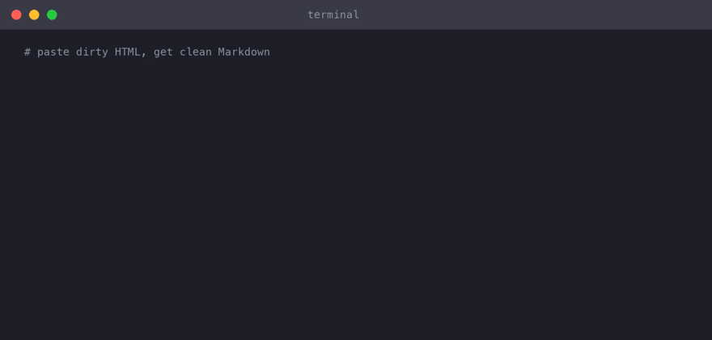

# clean-copy (CLI)

[](https://github.com/mahope/clean-copy-cli/releases)
[](LICENSE)
[](https://github.com/mahope/homebrew-clean-copy)
[](https://github.com/marketplace/actions/clean-copy-html-to-markdown)
[](https://nodejs.org)
[](package.json)

**Copy/paste text as clean Markdown or plain text** — straight from your terminal. The same converter engine that powers the [Clean Copy browser extensions](https://github.com/mahope/clean-copy), packaged as a zero-dependency Node.js CLI.



## Use cases

| Use case | Command |
|----------|---------|
| **Convert an HTML file to Markdown** | `clean-copy article.html` |
| **Fetch a web page as readable Markdown** | `clean-copy -u https://example.com/blog` |
| **macOS: paste dirty HTML, get clean Markdown** | `pbpaste \| clean-copy \| pbcopy` |
| **Linux: same with xclip** | `xclip -o \| clean-copy \| xclip -selection c` |
| **Git commit message from PR description** | `curl -sL https://github.com/... \| clean-copy -t` |
| **Strip formatting from email snippets** | `clean-copy -t email_dump.html` |
| **CI: convert a URL to Markdown in a workflow** | _See GitHub Action below_ |

## Install

### Homebrew (macOS / Linux, recommended)

```bash
brew tap mahope/clean-copy
brew install clean-copy
```

### Direct download (no package manager)

```bash
curl -L https://github.com/mahope/clean-copy-cli/releases/download/v1.5.0/clean-copy-1.5.0.tar.gz \
  | tar xz --strip-components=1
sudo cp clean-copy.js /usr/local/bin/clean-copy
```

### From source

```bash
git clone https://github.com/mahope/clean-copy-cli.git
cd clean-copy-cli
# Run in place:
./clean-copy.js -u https://example.com
# Or install globally:
npm link
```

Requires Node.js 16+. **Zero npm dependencies** — the converter is pure JavaScript.

## Quick start

```bash
# Convert HTML from stdin
echo '<h1>Hi</h1><p>Some <b>bold</b> text</p>' | clean-copy
# → # Hi\n\nSome **bold** text

# Convert a local HTML file to Markdown
clean-copy -o output.md article.html

# Fetch a web page and extract readable content as Markdown
clean-copy -u https://en.wikipedia.org/wiki/Markdown > wikipedia.md

# Plain text mode (strips all Markdown formatting)
clean-copy -t rich_text.html

# macOS: round-trip clipboard through cleaner
pbpaste | clean-copy | pbcopy

# Copy result to clipboard AND save to file
clean-copy -c -o cleaned.md dirty.html
```

### GitHub Action

Convert any URL, local file, or raw HTML to clean Markdown directly in your workflow:

```yaml
- uses: mahope/clean-copy-cli@v1
  with:
    url: 'https://example.com/article'
  id: clean-copy

- name: Save the result
  run: echo "${{ steps.clean-copy.outputs.markdown }}" > article.md
```

Convert a local HTML file in the repo:

```yaml
- uses: mahope/clean-copy-cli@v1
  with:
    file: 'docs/draft.html'
    output_file: 'docs/draft.md'
```

Convert raw HTML from a CI step:

```yaml
- uses: mahope/clean-copy-cli@v1
  with:
    html: '<h1>Generated</h1><p>CI output</p>'
    mode: 'markdown'
```

| Input          | Default      | Description                                                    |
|----------------|--------------|----------------------------------------------------------------|
| `url`          | (optional)   | URL to fetch and convert (one of url/file/html required)       |
| `file`         | (optional)   | Path to a local HTML file in the repo to convert               |
| `html`         | (optional)   | Raw HTML string to convert directly                            |
| `mode`         | `markdown`   | Output format: `markdown` or `plain`                           |
| `output_file`  | (optional)   | Write the result to this file path for use in later steps      |

**Output:** `markdown` — the converted content.

**Example: weekly page snapshot as a PR**

```yaml
name: Weekly snapshot
on:
  schedule:
    - cron: '0 6 * * 1'  # Monday 06:00 UTC
jobs:
  snapshot:
    runs-on: ubuntu-latest
    steps:
      - uses: actions/checkout@v4
      - uses: mahope/clean-copy-cli@v1
        with:
          url: 'https://example.com/changelog'
          output_file: 'docs/changelog-snapshot.md'
      - uses: peter-evans/create-pull-request@v6
        with:
          commit-message: 'chore: update changelog snapshot'
          title: 'Weekly changelog snapshot'
          branch: snapshot/changelog
```

### Options

| Flag | Effect |
|------|--------|
| `-t`, `--text` | plain text output instead of Markdown |
| `-w`, `--wikilinks` | Obsidian-style output: internal links become `[[WikiLinks]]`; external links, images and code blocks are untouched |
| `-v`, `--csv` | tables become comma-separated CSV rows (RFC 4180); no tables → cleaned plain text |
| `-u`, `--url URL` | fetch a web page and extract its main content |
| `-o`, `--out FILE` | write to FILE instead of stdout |
| `-c`, `--copy` | also copy the result to the system clipboard |
| `-q`, `--quiet` | no summary line on stderr |
| `-V`, `--version` | print version |

## What it converts

Headings (`#`–`######`), bold/italic, links, images, nested lists, ordered lists, code blocks with entity decoding (`&lt;` becomes `<`), blockquotes and tables → GitHub-flavored pipe tables. Smart quotes, em-dashes, zero-width characters and `&nbsp;` junk are normalized to clean ASCII.

The `--url` mode strips scripts, styles, nav/footer boilerplate and keeps the largest content block — good for articles, docs pages and blog posts.

## Supported platforms

The `--url` extraction mode is tested live (in `test.js`) against real pages
from every major publishing platform. If it works on your site, it works —
the extractor is CMS-agnostic and never requires anything installed on the
server.

| Platform | Live-tested example |
|----------|---------------------|
| MediaWiki | [Wikipedia](https://en.wikipedia.org/wiki/Markdown) |
| Shopify (custom storefront) | [shopify.com/blog](https://www.shopify.com/blog/what-is-ecommerce) |
| Wix | [wix.com/blog](https://www.wix.com/blog/what-is-a-blog) |
| Squarespace | [blog.squarespace.com](https://blog.squarespace.com/how-to-start-a-blog) |
| Ghost | [ghost.org/resources](https://ghost.org/resources/) · [404media.co](https://www.404media.co/404-media-now-has-a-full-text-rss-feed/) |
| Substack | [Astral Codex Ten](https://www.astralcodexten.com/p/moderation-is-different-from-censorship) · [The Pragmatic Engineer](https://newsletter.pragmaticengineer.com/p/the-pulse-we-need-to-talk-about-migrations) |
| Astro / static site | [astro.build](https://astro.build/blog/astro-720/) |
| WordPress | [CSS-Tricks](https://css-tricks.com/snippets/css/a-guide-to-flexbox/) |
| Next.js | [deno.com/blog](https://deno.com/blog/v2.3) |
| Eleventy | [v8.dev](https://v8.dev/blog/json-stringify) |
| Custom static | [blog.rust-lang.org](https://blog.rust-lang.org/2026/08/21/enabling-next-solver-on-nightly/) |

All of these run in CI on every push — a regression on any platform fails the build.

## Privacy

No analytics, no tracking, no telemetry. The only network request ever made is the one *you* trigger with `--url`. Everything else runs locally.

## License

MIT